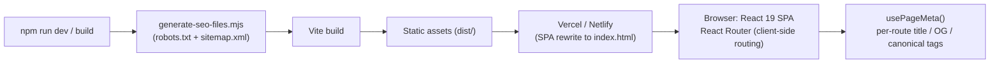
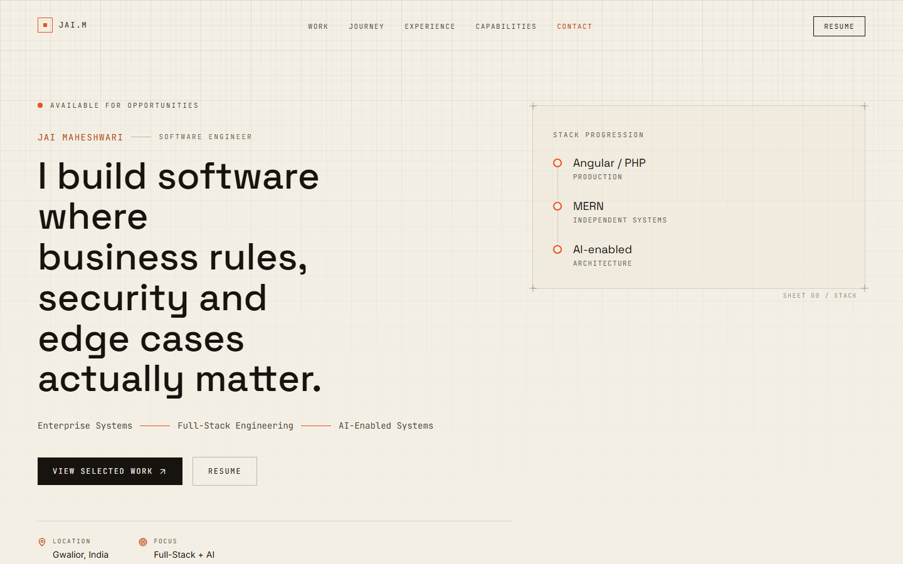
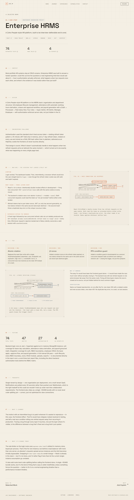
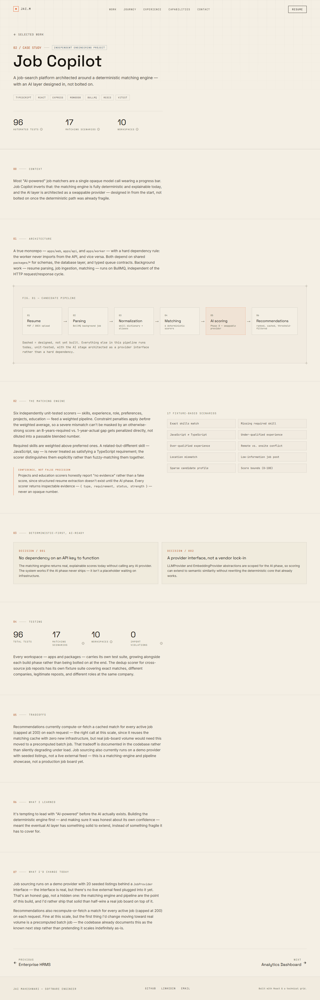

# Jai Maheshwari — Portfolio

A software-engineering portfolio built as an evidence-sourced "engineering notebook" rather than a marketing page.

[](https://github.com/jaimaheshwari1706/portfolio/actions/workflows/ci.yml)


## Overview

A React 19 + TypeScript single-page application that presents three independent
engineering projects (Enterprise HRMS, Job Copilot, Analytics Dashboard) as
case studies, alongside a summary of production experience at a real employer
(Ubitech Solutions). The whole site is a static client-rendered SPA — no
backend, no CMS — with content authored as typed data (`src/data/`) and
rendered through presentational components.

## Problem

Most engineering portfolios are unverifiable adjectives — "passionate",
"full-stack ninja" — with project cards that can't be checked against
anything. This site is built around a different rule: every claim (test
counts, RBAC role counts, the BUG-001 race-condition story) is sourced from
the actual project repositories it links to, not written for effect. It also
has to solve a narrower, real problem: clearly separating **production
experience at a real employer** (Ubitech — sanitized to outcomes, not
implementation) from **independent, self-directed engineering projects**
(Enterprise HRMS, Job Copilot, Analytics Dashboard), so the two are never
conflated in a recruiter's read of the page.

## Architecture

Purely static: there is no server or database in this repository. The
diagram below is the build → deploy → runtime path.



Content flows one way: `src/data/*.ts` (typed copy) → `src/sections/` and
`src/pages/` (composition) → `src/components/` (presentation only). No prose
lives directly in JSX.

## Engineering Decisions

- **Two-tier color system.** `--color-signal` (`#E8541C`) is the vivid
  decorative accent; `--color-signal-dim` (`#B33F13`) is a darker variant
  used anywhere the color is actual text. The bright value fails WCAG AA at
  normal text sizes — verified with a contrast calculator, not eyeballed —
  so text and decoration intentionally use different shades of the same hue.
- **Data/component separation.** All copy lives in `src/data/*.ts`; components
  only render it. This keeps every factual claim on the site in one place
  that's easy to audit and update, instead of scattered across JSX.
- **SEO files generated from one source.** `scripts/generate-seo-files.mjs`
  generates `robots.txt` and `sitemap.xml` from the same `VITE_SITE_URL` that
  `src/config/site.ts` reads at runtime, so the two can't drift from each
  other or from the app's own canonical tags.
- **Accessibility as a build gate, not an afterthought.** Skip-to-content
  link, focus trap + `inert` background in the mobile nav, single `<h1>` per
  page with no skipped heading levels, and a zero-violation `axe-core` scan
  per route enforced in the Playwright suite itself — not just checked once
  by hand.

## Trade-offs

- **Client-rendered SPA, not SSR/SSG** — chosen for zero-backend, pure static
  hosting (Vercel/Netlify) and build simplicity. The trade-off is weaker
  crawler-side SEO than a server-rendered site would give; mitigated with
  runtime-injected per-route meta tags and a generated sitemap, but it's not
  equivalent to true SSR.
- **oxlint over ESLint** — much faster and needs no config for this project's
  needs, at the cost of a smaller plugin ecosystem if the linting needs grow
  more custom later.
- **Content as typed TS files, not a CMS** — keeps every claim on the site
  co-located with the code that renders it and type-checked at build time.
  The trade-off is that any content edit is a code change and a redeploy,
  not something a non-technical editor could do.
- **One global OG image, not per-route** — a single `public/og-image.png`
  covers every page's social preview. Simpler pipeline, but case-study links
  shared individually don't get a page-specific preview image.

## Testing

```bash
npm run build && npm run preview   # tests run against the built site
npm test                           # Playwright suite (starts preview automatically)
npm run test:ui                    # Playwright's interactive UI mode
```

**51 Playwright tests, verified passing** across 5 spec files:

| Spec | Covers |
|---|---|
| `accessibility.spec.ts` | axe-core scan per route, skip link, heading hierarchy, reduced-motion, zero horizontal overflow at 375/768/1024/1440px |
| `case-studies.spec.ts` | All 3 case-study routes via **direct navigation** (not just client-side link clicks — this is what actually catches SPA routing regressions), project-type badges, back-navigation |
| `homepage.spec.ts` | Title/hero content, zero console errors, all 3 project cards + case-study links, sourced-evidence section |
| `links-and-404.spec.ts` | 404 page (route, noindex tag, home link), no placeholder `#`/fake `mailto:` CTAs, real GitHub link |
| `navigation.spec.ts` | Desktop nav scroll-to-section, mobile menu focus trap + `Escape` + `inert` background |

## Screenshots

**Home**


**Case study — Enterprise HRMS**


**Case study — Job Copilot**


## Getting Started

**Prerequisites:** Node.js 22+, npm

```bash
npm install
cp .env.example .env   # optional locally; only matters for SEO file generation
npm run dev             # http://localhost:5173
```

`predev`/`prebuild` automatically regenerate `public/robots.txt` and
`public/sitemap.xml` from `VITE_SITE_URL` (see `.env.example`).

```bash
npm run build   # tsc -b && vite build
npm run lint    # oxlint
npm test        # Playwright suite
```

### Deployment

The app is a client-rendered SPA using `BrowserRouter`, so the host must
rewrite all paths to `index.html` — otherwise a direct load or refresh on
`/work/enterprise-hrms` 404s at the server level before React Router runs.

- **Vercel** — `vercel.json` (included) already configures the rewrite. Import
  the repo, set `VITE_SITE_URL` in the project's environment variables, deploy.
- **Netlify** — `public/_redirects` (included) already configures the
  rewrite. Build command `npm run build`, publish directory `dist`, set
  `VITE_SITE_URL` in site environment variables.
- **Other static hosts** — configure an equivalent catch-all rewrite to
  `/index.html` (a rewrite, not a redirect, so the URL bar keeps the path).

After deploying, rebuild with the real `VITE_SITE_URL` set so
`robots.txt`/`sitemap.xml` and the canonical/OG tags point at the real domain
instead of the placeholder.

## Project Structure

```
src/
  config/site.ts     Single source of truth: domain, email, socials, resume
                      path, availability flag.
  data/               All copy and structured content — no prose in JSX.
    profile.ts          Hero copy, stack progression, links
    projects.ts           Selected Work — problem/decision/proof per project
    experience.ts            Ubitech production experience, outcome-first
    journey.ts                 Engineering journey timeline
    skills.ts                    Capabilities matrix groups
  components/
    ui/               Reusable, mostly presentational
    layout/            Navigation, Footer, page-level chrome
  sections/           Homepage sections (Hero, SelectedWork, ...)
  pages/              Route-level components (Home, case studies, 404)
  lib/                Motion variants, per-route meta tags, JSON-LD
scripts/
  generate-seo-files.mjs   Generates robots.txt + sitemap.xml before dev/build
tests/e2e/            Playwright test suite (see Testing above)
```

## Future Improvements / Roadmap

Tracked as `TODO(content)` in `src/config/site.ts` and `src/data/projects.ts` —
not fabricated here, just listed honestly:

- Replace the placeholder domain (`jaimaheshwari.dev` does not currently
  resolve) and set `VITE_SITE_URL` on the deploy host once this site is
  actually deployed. (Contact email and LinkedIn handle are no longer
  placeholders — sourced from the GitHub profile README, which already had
  real values filled in.)
- Add a real, hosted resume PDF at the path used by `resumeUrl`.
- Wire the (currently unused) `ProjectScreenshot` component into each case
  study with real product screenshots — `projects.ts` entries now link to
  all three real, public repos via `repo`, so the screenshots those repos
  just gained could be pulled in here too.
- `react-router`/`react-router-dom` currently carry a high-severity advisory
  ([GHSA-qwww-vcr4-c8h2](https://github.com/advisories/GHSA-qwww-vcr4-c8h2))
  scoped to RSC mode, which this app doesn't use; worth a non-breaking
  upgrade pass when one is available (the current advisory fix path is a
  downgrade, not an upgrade).

## License

Not yet licensed — no `LICENSE` file exists in this repository, so all
rights are reserved by default (`package.json` reflects this as
`"license": "UNLICENSED"`).

## Learn More

- [GitHub](https://github.com/jaimaheshwari1706)
